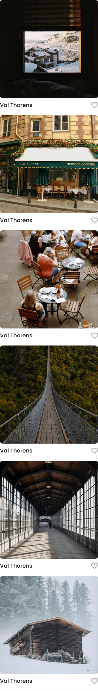

# Project 3: Spots

## Description:

Spots is an interactive social media web application where you can view galleries. Once you create a profile you have the ability to add and remove photos, as well as liking others' posts.

## Technologies and Techniques

- Figma templates

* HTML

* CSS
* Adaptive Screen Designs
* smooth transitions
* grid
* flexbox

## Images and Video

## Deployment

Visit the site at: https://ashput2025.github.io/se_project_spots/

## Videos

Video going through the techniques used in this app:
https://drive.google.com/file/d/1gpB0voHyIdPRE0k0APmksbfMgKpj0scU/view?usp=drive_link
